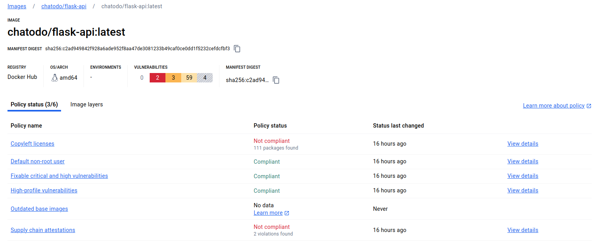

Projet de l'UE : *Programmation Web et Distribuée*

Groupe : **Ivan KRIVOKUCA - Abdel Malik FOFANA**
# TL;DR
**Nécessaire : Docker, Kubernetes, Kubectl, Istio**

Projet **local** qui réunit **deux services**, **un service-mesh**, **gateways** et une **base de données** via Kurbernetes :
- <span style="color:#0070c0">*Flask* : Rôle Back-End : Joue le rôle d'une l'API, gère la connectivité avec les utilisateurs et communique avec la base de données </span>
- <span style="color:orange"> *Nginx* : Rôle Front-End : Affichage du contenu statique en fonction de ce que renvoie Flask </span>
- <span style="color:violet"> *MySQL* : Stocke les informations relatives aux produits et au utilisateurs </span>

*Voici un exemple d'un chemin de login réussit*


## Déployer sur Kubernetes
Tout d'abord on crée un secret Kubernetes :
```
kubectl create secret generic mysql-secret \
  --from-literal=host='mysql' \
  --from-literal=username='flask' \
  --from-literal=password='password' \
  --from-literal=db='NOM_DB'
```
<span style="color:#00b050">⚠ Après avoir initialiser ce secret, il faut <b>impérativement</b> se connecter au pod et faire les instructions de <i>la partie 3)</i> ➡ 
<a href="https://github.com/charroux/noops/tree/main/mysql#3-connexion-au-server-mysql">ICI </a> (avec les identifiants de notre secret)
</span>

⚠ Il faut <span style="color:#00b050"><b>aussi</b></span> faire les commandes dans [HTTPS](#https)


Ensuite, on applique les déploiements suivants : 

```
kubectl apply -f mysql/mysql.yml
kubectl apply -f flask/flask.yml
kubectl apply -f nginx/nginx.yml
# Si on veut activer mTLS
kubectl apply -f mtls/enable-mtls.yml
kubectl apply -f mtls/destination-rule-mtls.yml
```

Pour finir, on exécute soit `./ingress-forward.sh` (pour avoir le *http*) ou `./ingress-forward-https.sh` (pour avoir le *https*)

Avec `./ingress-forward-https.sh`, le résultat attendu est le suivant :


- Inscription :

- Après la connexion :


- On se connecte avec *admin* : *admin* pour accéder à une **page admin** qui permet de voir la liste des utilisateurs créés ainsi que de pouvoir ajouter un produit.
Ici on ajoute un produit (celui qui est afiché pour l'utilisateur)


# Sommaire
* [TL;DR](#tldr)
* [Déployer sur Kubernetes](#déployer-sur-kubernetes)
* [Les applications](#les-applications)
  * [Flask](#flask)
  * [Nginx](#nginx)
* [Construction des images Docker](#construction-des-images-docker)
* [Fichier YAML](#fichier-yaml)
  * [Fichier : `flask/flask.yml`](#fichier--flaskflaskyml)
    * [Déploiement](#déploiement)
    * [ServiceType](#servicetype)
    * [Gestion du Trafic avec Istio](#gestion-du-trafic-avec-istio)
  * [Fichier : `nginx/nginx.yml`](#fichier--nginxnginxyml)
    * [Déploiement](#déploiement-1)
    * [ServiceType](#servicetype-1)
    * [Gestion du Trafic avec Istio](#gestion-du-trafic-avec-istio-1)
  * [Fichier : `mysql/mysql.yml`](#fichier--mysqlmysqlyml)
    * [Déploiement](#déploiement-2)
    * [ServiceType](#servicetype-2)
* [Sécurisation du cluster](#sécurisation-du-cluster)
  * [MTLS](#mtls)
  * [Sécurisation image Registry](#sécurisation-image-registry)
  * [HTTPS](#https)
* [Google Labs](#google-labs)


# Explication en détail
## Les applications
### Flask
1. **Gestion des Utilisateurs** :
    - **Authentification** : Les utilisateurs peuvent se connecter et se déconnecter en utilisant des routes API dédiées. La sécurité des mots de passe est assurée par `flask_bcrypt`, qui hash les mots de passe avant leur stockage.
    - **Inscription** : Les nouveaux utilisateurs peuvent s'inscrire via une API qui enregistre leurs informations après vérification que l'email n'est pas déjà utilisé.
    - **Gestion de Session** : Les sessions sont gérées via `flask_session` avec une configuration provenant du ficher `instance/config_session.py`
2. **Gestion des Produits** :
    - **Liste des Produits** : Une route permet aux utilisateurs authentifiés de récupérer la liste des produits disponibles (en stock).
    - **Ajout de Produits** : Les administrateurs peuvent ajouter de nouveaux produits à la base de données via une interface API.
### Nginx
1. **Gestion des Utilisateurs** :
    - **Authentification et Inscription** : Des modaux Bootstrap sont utilisés pour permettre aux utilisateurs de se connecter ou de s'inscrire. Ces actions sont gérées via des appels AJAX à l'api Flask.
    - **Gestion de Session** : L'état de connexion de l'utilisateur est géré par des scripts/et cookies qui affichent ou masquent des éléments de l'interface en fonction de l'état de connexion.
2. **Interaction avec l'API** :
    - **Visualisation des Produits** : Si l'utilisateur est connecté alors les produits sont chargés et affichés via AJAX.
    - **Administration** : Redirigée vers `/admin.html`. Les utilisateurs administrateurs ont la possibilité d'ajouter des produits et de voir la liste des personnes inscrites.
    - **Modification de Profil** : Les utilisateurs peuvent mettre à jour leur adresse email et leur mot de passe
    - **Déconnexion** : Un bouton permet aux utilisateurs de se déconnecter, ce qui réinitialise l'interface utilisateur.

## Construction des images Docker
Construction des images Docker (également présentes sur [DockerHub](https://hub.docker.com/u/chatodo))
```
docker build -t flask-app:latest flask/
docker build -t frontend-nginx:latest nginx/
```
## Fichier YAML

### Fichier : `flask/flask.yml`

#### Déploiement
- Replicas : 2 (= deux instances du pod en parallèle)
- Labels : flask-api
- Image Docker exécutée : `chatodo/flask-api:latest`
- Exposé sur le port *5000* (configuration de *Flask*)
- Variable environment définie grâce au secret *mysql-secret*
```yml 
env:
- name: MYSQL_HOST
	valueFrom:
	secretKeyRef:
		name: mysql-secret
		key: host
...
```
#### ServiceType 
- **NodePort** sur le *port 5000*
#### Gestion du Trafic avec Istio
- *Gateway Istio* : Le Gateway Istio est configuré pour écouter à la fois sur les ports HTTP (80) et HTTPS (8443).
- *Configuration du VirtualService Istio* : VirtualService dirige le trafic entrant vers l'API Flask basé sur le chemin URI `/api`
```yml 
apiVersion: networking.istio.io/v1alpha3
kind: Gateway
metadata:
  name: flask-gateway
spec:
  selector:
    istio: ingressgateway
  servers:
    - port:
        number: 80
        name: http
        protocol: HTTP
      hosts:
        - "*"
    - port:
        number: 8443
        name: https
        protocol: HTTPS
      tls:
        mode: SIMPLE
        credentialName: nginx-certs
      hosts:
        - "*"
---
apiVersion: networking.istio.io/v1alpha3
kind: VirtualService
metadata:
  name: flask-virtualservice
spec:
  hosts:
    - "*"
  gateways:
    - flask-gateway
  http:
    - match:
        - uri:
            prefix: /api
      route:
        - destination:
            host: flask-api.default.svc.cluster.local
            port:
              number: 5000
```

### Fichier : `nginx/nginx.yml`
#### Déploiement
- Replicas : 2
- Labels : frontend-nginx
- Image Docker exécutée : `chatodo/frontend-nginx:latest`
- Exposé sur le port *80* (configuration de *Nginx*)
#### ServiceType 
- **NodePort** sur le *port 80*
#### Gestion du Trafic avec Istio
- **Hosts et Gateways** : Utilisation de flask-gateway
- **Routage du Trafic** : Dirige les requêtes vers le front-end pour les chemins `"/"` et `/admin.html`. Les requêtes destinées à `/api` sont redirigées vers le back-end Flask
```yml
http:
  - match:
      - uri:
          exact: "/"
      - uri:
          prefix: "/admin.html"
    route:
      - destination:
          host: frontend-nginx.default.svc.cluster.local
          port:
            number: 80
  - match:
      - uri:
          prefix: "/api"
    route:
      - destination:
          host: flask-api.default.svc.cluster.local
          port:
            number: 5000
```

### Fichier : `mysql/mysql.yml`
Fortement inspiré de cette source ➡ https://github.com/charroux/noops/tree/main/mysql
#### Déploiement
- Type = `Recreate`. L'ancien Pod est supprimé avant que le nouveau Pod soit créé, ce qui est particulièrement utile pour les bases de données où le maintien d'une seule instance à la fois est crucial pour éviter les conflits de données.
- Image Docker exécute : `mysql:5.6`
- Exposé sur le port *3306*
- Mot de passe défini grâce au secret *mysql-secret*
- Stockage Persistant, revendication de volume persistant
#### ServiceType 
- **NodePort** sur le *port 3306*

## Sécurisation du cluster
### MTLS
Affichage du dashboard Kiali : `istioctl dashboard kiali`
Cela permet de visualiser le graphique de notre service avec la gateway.

On remarque le mTLS est bien activé 


### Sécurisation image Registry
Il faut activé dans une image de notre répertoire "*Image Analysis*"

Ensuite, on se redirige vers : https://scout.docker.com/reports/org/chatodo/images pour voir le rapport associé.
Après une modification de notre *Dockerfile* on obtient le rapport suivant :


### HTTPS
(Tout sera fait localement)
Tout d'abord, il est nécessaire d'obtenir un certificat pour utiliser HTTPS.
Voici une commande qui permet de générer un certificat 
`openssl req -x509 -nodes -days 365 -newkey rsa:2048 -keyout tls.key -out tls.crt -subj "/CN=localhost"`
Cependant, ce certificat n'étant pas certifié par une AC on aura l’avertissement de type : `err_cert_common_name_invalid`, mais en soit c'est fonctionnel.

Pour éviter cela, j'ai opté pour l'utilisation de [mkcert](https://github.com/FiloSottile/mkcert)
Après l'avoir installé, on effectue :
```
mkcert --install
mkcert localhost 127.0.0.1 ::1
mv localhost+2.pem tls.crt
mv localhost+2-key.pem tls.key
```

⚠ Il faut que *istio-system* soit actif, si besoin :
`kubectl label namespace istio-system istio-injection=enabled --overwrite`

Ensuite, on crée le secret nécessaire pour le déploiement et on le réapplique
```
kubectl create secret tls nginx-certs --cert=tls.crt --key=tls.key -n istio-system
kubectl apply -f nginx/nginx.yml
```
On obtient bien le résultat attendu : 


## Google Labs
